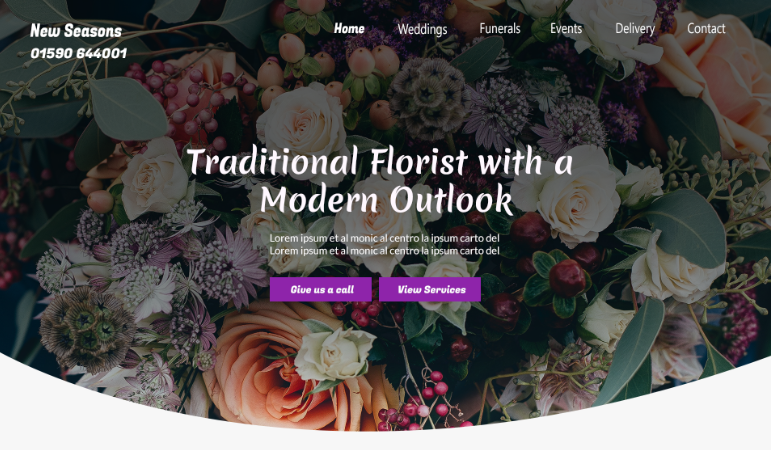

# 💐 Florist WordPress Theme

An older custom WordPress theme built using Timber and Twig, from a time when I was deepening my understanding of WordPress template hierarchy, Timber integration, and front-end tooling. The theme powers a florist website with support for custom post types and ACF.

---

## 🚀 Key Features

- 🌲 Timber-powered theme using Twig for template rendering  
- 🎨 SCSS-based styling with modular partials  
- 🧩 ACF field groups for dynamic content  
- 🗂️ Custom Post Types: **Services**, **Occasions**, and **Testimonials**  
- 🧪 Dummy data included for local development and testing  
- 📦 Exported ACF Field Groups available in the project root  

---

## 🛠 Requirements

- WordPress (latest stable recommended)  
- [Local](https://localwp.com/) by Flywheel for dev environment  
- PHP 7.4+ (or compatible with current WP)  
- Node.js (for SCSS compilation, if applicable)  
- Composer  

---

## 🔧 Local Development Setup

I choose to use [Local](https://localwp.com/) to spin up a quick local LAMP server with WordPress. 

### 1. Create a New Site in Local

- Open Local and create a new WordPress site.  
- Once created, navigate to the `wp-content/themes/` folder.  

### 2. Clone or Copy the Theme

```bash
cd wp-content/themes/
git clone https://github.com/carlhumm/florist-theme.git
```

Or copy the theme folder directly into the `themes/` directory.

---

## 🧩 Installation Steps

### 1. Activate the Theme

Log into your WordPress dashboard and activate the **Florist** theme under **Appearance → Themes**.

### 2. Install Required Plugins

- [Advanced Custom Fields (ACF)](https://wordpress.org/plugins/advanced-custom-fields/)  
- [Timber](https://wordpress.org/plugins/timber-library/)  

> You may use Composer to manage these dependencies, or install via the dashboard.

### 3. Import ACF Field Groups & Dummy Data

#### ACF

- Navigate to **Custom Fields → Tools**  
- Import the `.json` field group files located in the project root  

#### Dummy Content

- Go to **Tools → Import**  
- Use the built-in WordPress Importer to load the provided `.xml` sample content  

---

## ⚙️ SCSS Structure

- SCSS partials located in `/assets/scss/`  
- Compile to CSS manually or with a task runner (This project uses gulp with npm scripts)
- Recommended build:  

```bash
npm install && npm run dev
```

---

## 🧠 Challenges Faced

- Gaining fluency with WordPress template hierarchy alongside Timber’s context-driven approach  
- Managing SCSS modularity without over-complicating the build  
- Structuring reusable Twig partials for better theme maintainability  
- Learning the balance between logic in PHP vs Twig templates  

---

## ✅ Future Plans & Refactor Goals

- 🧱 Overhaul front-end design to modern standards  
- 🔁 Remove **Testimonials** post type and switch to fetching from API.
- 🧠 Refactor Twig templates for better context reuse  
- 🧙‍♂️ Create a **custom form wizard plugin** for:  
  - Flower selection  
  - Delivery date/time scheduling  
  - Booking confirmations 
  - Tracking 

  - Install ACF Pro with Composer, identify and create missing fields and fieldgroups, populate data, export.

---

## 📬 Contact

Have questions, feedback, or want to collaborate? Feel free to reach out.
